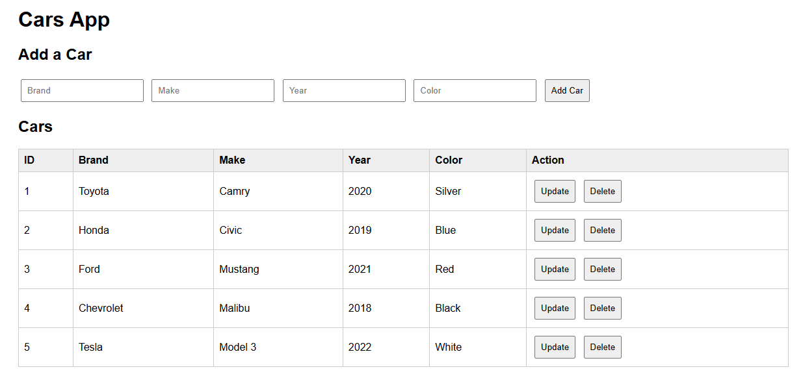
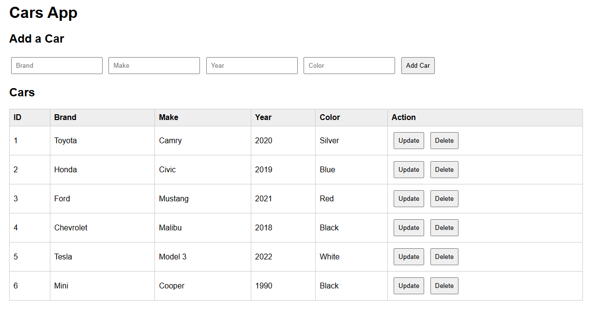
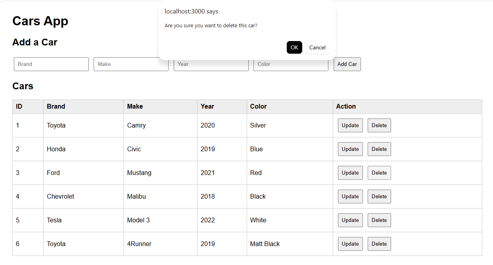
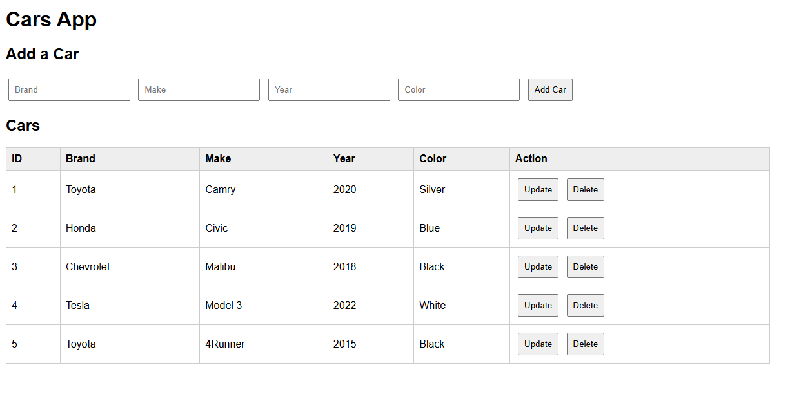

# node04

#### Adding Delete and update action button

## Overview
This project is a simple Cars App build using HTML, JavaScript, Node.js, and Exptess. This application allows users to:
* view all cars
* add new cars
* update existing cars
* delete cars
The frontend communicates witht the backend API using JavaScript fetch() requets. 

## Features Added
###### Action Buttons
An Action column was added to the table. Each row now contais:
+ An Update button
+ A Delete button
These buttons allows the user to modify or remove records directly from the table. 

## Delete Functionality
###### How it works
When the user clicks the Delete button:
* A confirmation message appears using confirm()
* if confirmed, JavaScript sends a DELETE request to the backend API
* The server removes the car from the array
* The table refreshes automatically using loadCars()

###### Frontend Request
```js
await fetch(`/api/cars/${id}`, {
  method: "DELETE"
});
```
###### Backend Route
```js
app.delete("/api/cars/:id")
```
This route finds the car by ID and removes it from the array using splice().

## Update Functionality
#### How it works
When the user clicks the Update button:
* The application first fetches the current car information
* prompt() windows appear allowing the user to edit:
  * Brand
  * Make
  * Year
  * Color
* JavaScript creates an updated object
* A PUT request is sent to the backend
* The backend updates the car record
* The table refreshes automatically

###### Frontend Request
```js
await fetch(`/api/cars/${id}`, {
  method: "PUT",
  headers: {
    "Content-Type": "application/json"
  },
  body: JSON.stringify(updatedCar)
});
```
###### Backend Rout
```js
app.put("/api/cars/:id")
```
The backend updates the selected car object while keeping the original ID.

## How the Table Updates
After adding, deleting, or updating a car, the function loadCars(); is called. 
The function:
* sends a GET request to /api/cars
* retrives the latest data
* clears the table
* rebuilds the table rows dynamically
This keeps the frontend sychronized with the backend data. 

## Screenshots
* Main Cars Table

* Adding a New Cars

* Updating a Car


* Deleting a Car



## What I Learned
Through this assignment, I learned:
* how frontend and backend communicated using APIs
* how to use fetch() with GET, POST, PUT, and DELETE methods
* how Express routes work
* how to dynamically update HTML tables using JavaScript
* how CRUD operations funciton in a web application